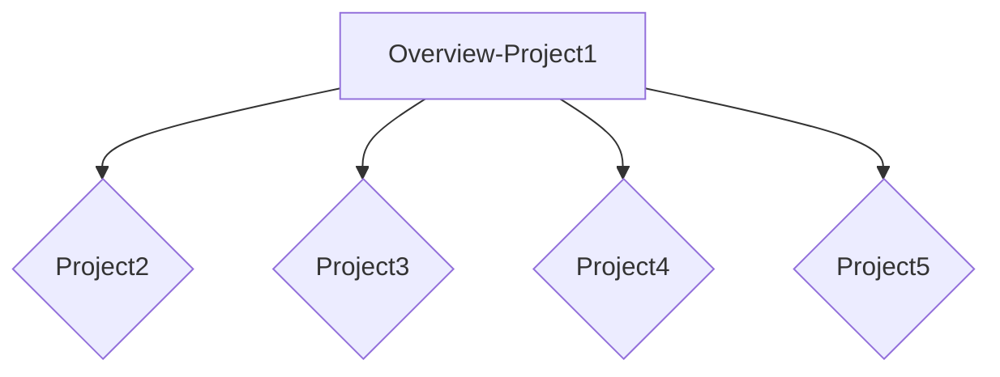

# CMPG 323 Overview - 27191532
 CMPG323 Planning for 2022

 ## Github repositories used for the semester
 1. CMPG323-Project2-27191532-Azure/.NETcore3.1 
 2. CMPG323-Project3-27191532-.NETcore3.1
 3. CMPG323-Project4-27191532-UiPath
 4. CMPG323-Project5-27191532-Power_BI_Reporting

 ## Project and Repository context

## Branching Strategy for each project
 1. Project1: Main
 2. Project2: Main, testing and developer
 3. Project3: Main, testing and developer
 4. Project4: Main, testing and developer
 5. Project5: Main, testing and developer

 ## Gitignore files in each project
  1. .txt file containing random thoughts on the project overview.
  2. All .txt files with sensitive information to keep them local.
  3. All .txt files with sensitive information to keep them local.
  4. All .txt files with sensitive information to keep them local.
  5. All .txt files with sensitive information to keep them local.

  ## Storage for credentials and sensitive information
  a .txt will be created that holds all sensitive information, this file will only be stored locally.
  All .txt files that contains sensitive information will be added to the .gitignore list.